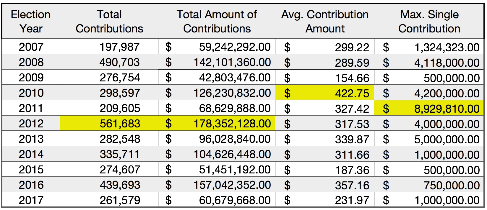
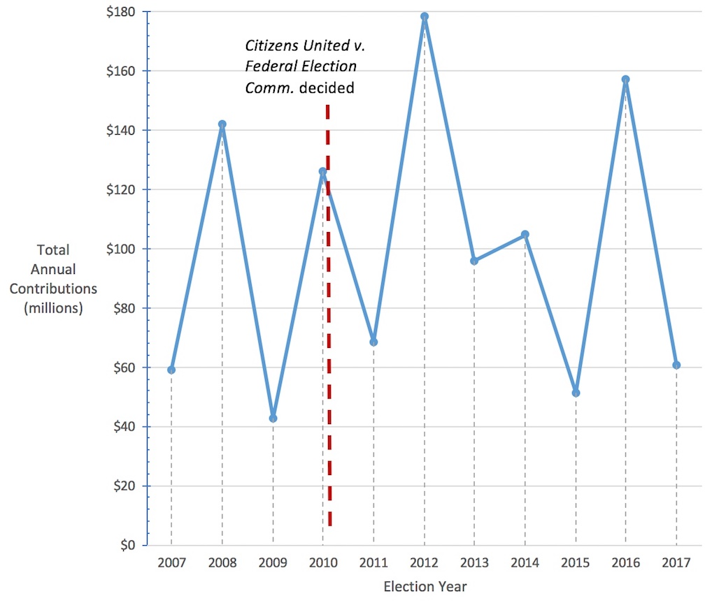
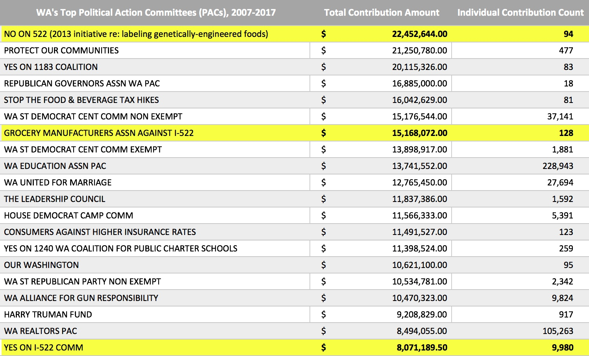
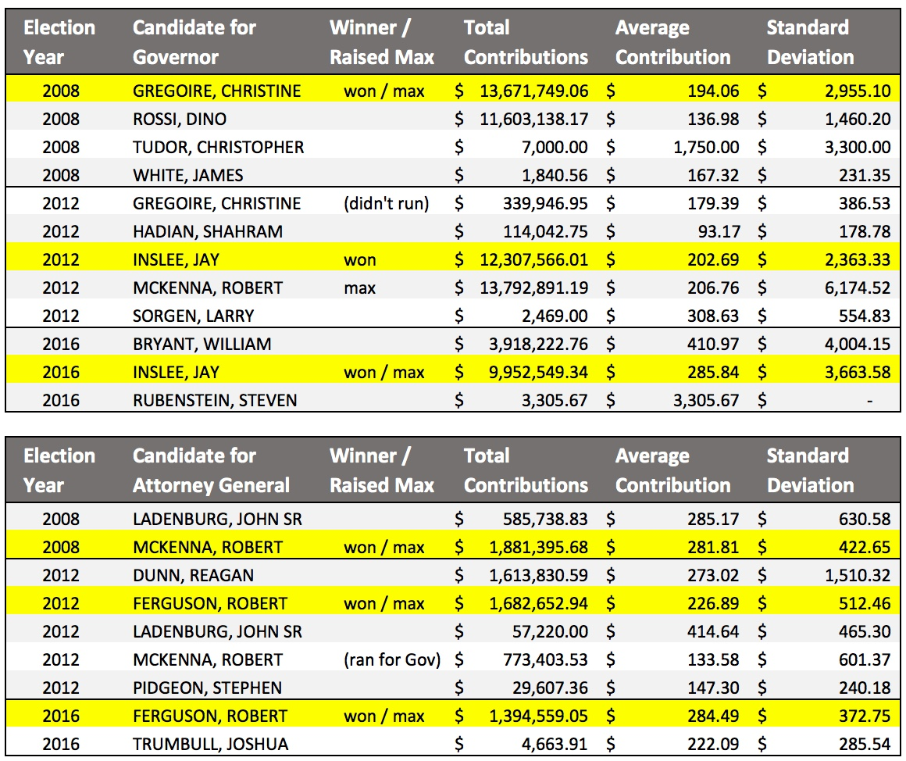
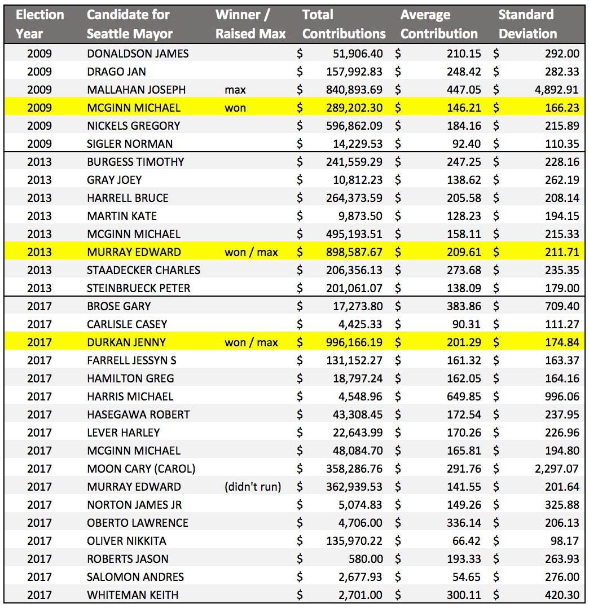

## data-512-finalproject  
The materials in this repository describe the final project in the Fall 2017 DATA 512 course in the Masters of Science in Data Science program at the University of Washington.  
  
Unless otherwise specified, any materials in this repository are released under the MIT License.  
  
Project prepared by Erin Orbits  

---------
  
## Project Purpose
1. Conduct a statistical analysis of the Washington state Contributions to Candidates and Political Committees data to look for trends and anomalies.  
2. Visualize the data and generate plots that help explain any insights from the data. 
3. Present the results.  
  
Among the 3,629,467 total individual contributions over the period of 2007-2017, only 758,358 were unique donors. So, the average donor contributed approximately 4.8 times. The sheer volume of data available in the original dataset means most journalists won't have time to analyze it. Therefore, as a practical matter, the voters do not really know who is funding the campaigns of candidates and initiatives. Analyzing the contribution data improves our understanding about who contributes to local political campaigns and how much they contribute. For example, the business that spent the most money overall and gave the largest single contribution of more than $8.9 million was Costco.  

  
  
The PACs receiving the most contributions over the period from 2007-2017  
  
  
As the tables below show, there were only two races where the candidate who raised the maximum amount of money didn't win the race for Governor of Washington State, Attorney General of Washington State or Mayor of Seattle.  

  
For more detail about the analysis, see the [A6-Final_Project](https://raw.githubusercontent.com/orbitse/data-512-finalproject/master/A6-Final-Project.ipynb).   

## About the Data  
The Contributions to Candidates and Political Committees dataset was downloaded from [data.wa.gov](https://data.wa.gov/Politics/Contributions-to-Candidates-and-Political-Committe/kv7h-kjyeOpens) and the dataset is in the Public Domain. The description of this dataset from the `data.wa.gov` site states:
  > This dataset contains cash and in-kind contributions made to Washington State Candidates and Political Committees for the last 10 years as reported to the PDC on forms C3, C4, Schedule C and their electronic filing equivalents. It does not include loans, pledges or any expenditures.
For candidates, the number of years is determined by the year of the election, not necessarily the year the contribution was reported. For political committees, the number of years is determined by the calendar year of the reporting period.  
  
  > Candidates and political committees choosing to file under "mini reporting" are not included in this dataset. See WAC 390-16-105 for information regarding eligibility.
This dataset is a best-effort by the PDC to provide a complete set of records as described herewith and may contain incomplete or incorrect information. The PDC provides access to the original reports for the purpose of record verification.  
  
  > Descriptions attached to this dataset do not constitute legal definitions; please consult RCW 42.17A and WAC Title 390 for legal definitions and additional information political finance disclosure requirements.
CONDITION OF RELEASE: This publication constitutes a list of individuals prepared by the Washington State Public Disclosure Commission and may not be used for commercial purposes. This list is provided on the condition and with the understanding that the persons receiving it agree to this statutorily imposed limitation on its use. See 
RCW 42.56.070(9) and AGO 1975 No. 15.  

__Data Attribute Information in the Original Dataset:__  

These are the 37 columns if you download the full dataset:  
id                            object  
report_number                 int64  
origin                        object  
filer_id                      object  
type                          object  
filer_name                    object  
first_name                    object  
middle_initial                object  
last_name                     object  
office                        object  
legislative_district          float64  
position                      object  
party                         object  
ballot_number                 float64  
for_or_against                object  
jurisdiction                  object  
jurisdiction_county           object  
jurisdiction_type             object  
election_year                 int64  
amount                        object  
cash_or_in_kind               object  
receipt_date                  object  
description                   object  
memo                          object  
primary_general               object  
code                          object  
contributor_name              object  
contributor_address           object  
contributor_city              object  
contributor_state             object  
contributor_zip               object  
contributor_occupation        object  
contributor_employer_name     object  
contributor_employer_city     object  
contributor_employer_state    object  
url                           object  
contributor_location          object  
  
For information about how to get and clean the data, see the notebook file: [Data-Cleaning](https://raw.githubusercontent.com/orbitse/data-512-finalproject/master/Get-Clean-Data.ipynb).
